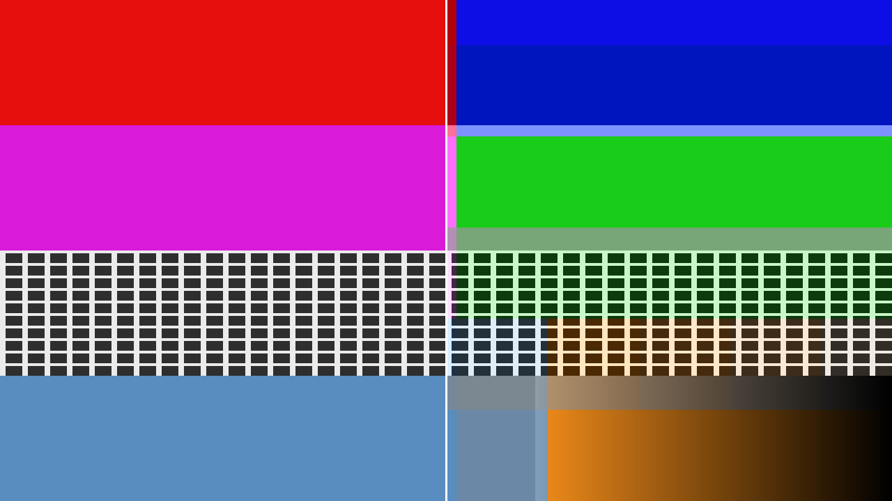
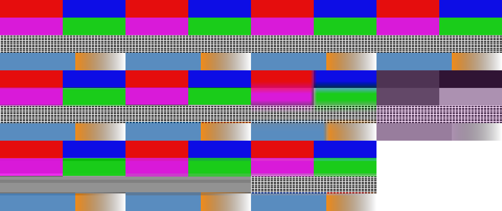

# Macroblock user guide

Macroblock is **chroma subsampling at any level** for [Resolume](https://resolume.com) Arena and
Avenue, as an FFGL plugin — and the same effect again as an OpenFX plugin for Resolve, Nuke,
Natron and Vegas. It throws colour resolution away on a grid you control, from the two-pixel pair
a codec uses up to a single colour for the entire canvas, and in Resolume the grid follows the
music.



*Left: the input. Right: the same frame with chroma sampled once per 131×131 block. Every line of
the grey grid is still exactly where it was — the detail is untouched — while the colour has moved
onto a coarse lattice and started bleeding across the band boundaries.*

> **Before you rely on this:** the sampling lattice is proved to partition the frame across 154
> combinations of block size and raster, including sizes that land between pixels; each block's
> value is checked against a box mean computed independently; the GPU and the OpenFX renderer are
> compared pixel for pixel across eleven configurations; and at zero the effect is **bit-identical**
> to its input, not merely close. All 24 controls are measured to change the picture.
>
> The audio side has been driven by real music through the same call Resolume makes, so the
> analyser and the onset detector have been exercised on more than a test tone.
>
> **It has not yet been run inside Resolume, or in any OpenFX host.** Nothing here knows what
> Resolume's spectrum bins mean in hertz, so which frequencies Low, Mid and High actually pick up
> in Arena is an assumption. The Windows build is made in CI and has never been run. None of it has
> been used on a live show.
>
> This codebase was created with AI assistance, directed and reviewed by a human author.

---

## Installing

```
macOS    ~/Documents/Resolume Arena/Extra Effects/
Windows  %USERPROFILE%\Documents\Resolume Arena\Extra Effects\
```

For OpenFX hosts, copy `Macroblock.ofx.bundle` into `/Library/OFX/Plugins` (macOS),
`C:\Program Files\Common Files\OFX\Plugins` (Windows) or `/usr/OFX/Plugins` (Linux). The macOS
builds are signed and notarised.

Restart the host after copying.

---

## The one idea

Video does not store colour at full resolution and never has. A codec splits the picture into
**luma** — brightness, where all the detail lives — and two **chroma** channels, then samples the
chroma on a coarser grid. H.264 and HEVC take one colour sample per 2×2 block of pixels. DV took
one per four pixels across. You have never noticed because at that scale it is genuinely hard to
see.

Macroblock makes that grid arbitrary.

**The consequence worth understanding before you touch anything:** subsampling chroma does not
soften the picture. Drag the chroma control to the end of its travel and every edge, every line,
every bit of texture is still exactly where it was — the frame just becomes a monochrome of its
own average colour. That is what makes this different from a pixelate or a mosaic, and it is why
there is a separate **luma** section for when you *do* want the detail to go.



*The input, then the ten factory presets. The first four are real sampling formats and do very
little, which is the point of them; the rest are what the effect can do that no format does.*

---

## Start here

Drop it on a layer and open the **Preset** menu.

| Preset | What it is |
|---|---|
| **4:2:2** | What every broadcast link and every ProRes file already is. It will look like it does nothing. That is the correct reaction. |
| **4:2:0** | H.264 and HEVC — so, almost everything you play. Applied a second time on top of the encoding it already has. |
| **4:1:1 (DV)** | A quarter of the colour horizontally. This is why standard-definition tape footage smears colour sideways off a red caption. |
| **4:1:0 (Video CD)** | About the coarsest thing ever shipped as a delivery format. |
| **Cheap Converter** | 4:1:0, but taking one pixel per block instead of averaging. Harder, noisier, obviously wrong. |
| **Colour Bleed** | Big chroma blocks reconstructed smoothly, so colour smears across the picture instead of tiling it. |
| **Single Chroma** | The end stop. One colour for the whole canvas, all detail intact. |
| **Luma Mosaic** | The inverse of every codec: brightness in blocks, colour edges untouched. |
| **Blocks** | Both lattices together, coarse enough to read from the back of a room. The one to reach for with the audio up. |
| **Wrong Space** | YCoCg in linear light — neither of which any real chain does, and a different set of colours collapses. |

Picking a preset sets the lattice controls and nothing else. It deliberately does **not** touch
Mix, Show Grid, or anything in the Audio group — so a preset cannot silently rewire your show to a
kick drum in the middle of it.

Move any control a preset covers and the menu falls back to **Custom**.

---

## The lattice

**Chroma H** and **Chroma V** set the block size. Below 64 pixels they are absolute: a twelfth of
the travel is a two-pixel block at 720p, at 1080p and at 4K alike, which is what lets the format
presets above be honest at any composition size. Above 64 pixels they are relative to your canvas,
so the end of the travel is one colour for the whole frame whatever you are running at.

Powers of two land on exact twelfths of the slider — 1/12 is 2 px, 1/6 is 4 px, 1/4 is 8 px, 1/3
is 16 px, 1/2 is 64 px.

**Link Chroma** is on by default and makes the blocks square. Turn it off for 4:2:2 and 4:1:1,
which subsample horizontally only.

**Luma H**, **Luma V** and **Link Luma** are the same three controls again, on an independent grid,
applied to brightness. No format does this. It reads as a mosaic that has kept its colour edges
exactly where they were.

---

## How a block gets its value

| Control | What it does |
|---|---|
| **Sampling** | *Average* is the box mean a real encoder takes. *Point* keeps one pixel per block — what a cheap converter does, and it looks it. |
| **Reconstruction** | *Blocky* holds one value flat across its block. *Smooth* interpolates between block centres, which is what a real decoder does — and at large blocks becomes a smear rather than a mosaic. |
| **Siting** | Where in its block a sample is considered to live. *Centred* is JPEG and MPEG-1, *co-sited* is MPEG-2 and most broadcast. **Only visible under Smooth.** |
| **Matrix** | Which luma/chroma split. Not cosmetic — it decides which colours survive being averaged. Rec. 709/601/2020 carry a blue and a red axis; YCoCg carries green and magenta, so a different pair collapses. |
| **Average In** | *Gamma* is what every real encoder does, luminance error on saturated edges included. *Linear light* is the physically defensible one, and is not video. |
| **Block Steps** | *Integer* is a real sampling lattice. *Free* lets the block size land between pixels, which sweeps smoothly instead of stepping — use it when audio is driving the size. *Powers of 2* is every broadcast format there is. |

**Show Grid** draws the block boundaries. It is a diagnostic for placing a lattice, not a look —
turn it off before the show.

---

## Making it follow the music

**Resolume only.** OpenFX has no audio to give a plugin, so that host gets the same effect without
this section.

Resolume hands the plugin a 64-bin spectrum every frame. Macroblock splits it into full-range, low,
mid and high, follows each band with an envelope, and normalises it against that band's own recent
peak — which is what makes the same settings work on a quiet stem and a mastered track.

**Audio Mode** picks the rule:

- **Follow** — the block size tracks the band. Breathing. Start here.
- **Step** — an onset detector latches a new size on each hit and it decays until the next one.
  Blocks snap on the beat instead of wobbling. This is the one you want on a kick.
- **Gate** — hard on above a threshold, off below.
- **Off** — the sliders are the truth.

**Chroma Audio** and **Luma Audio** are the amounts, and they are **centred**: the middle is off,
right pushes the blocks bigger, left pulls them smaller. Left is worth trying — audio that
*sharpens* the colour on a hit is a much rarer look than audio that coarsens it.

Each has its own **Band**. Low is the kick and bass; it is the default for chroma and it is usually
right.

**Attack** and **Release** shape the envelope in every mode. Fast attack and slow release is the
default and the safe choice.

**Sensitivity** is how easily it fires — the onset threshold in Step, the level threshold in Gate.
It has no effect in Follow.

**Hold** is Step only: how long a latched size takes to decay. At zero each hit is a spike; several
seconds and the size barely moves between beats.

### A patch that works

Preset **Blocks**, Audio Mode **Step**, Chroma Band **Low**, Chroma Audio about three-quarters,
Hold around a third, Block Steps **Integer**. The lattice snaps coarse on each kick and settles
between them.

Swap Block Steps to **Free** if you prefer it to glide rather than step.

---

## If it looks wrong

**Nothing happens at all.** Check Mix is up and that at least one of the four lattice sliders is
off zero. If the audio side specifically does nothing, check Resolume is actually playing audio
into the composition — the plugin only ever sees what the host gives it.

**It looks like a pixelate.** You have moved the Luma sliders rather than the Chroma ones. Zero
the Luma group.

**4:2:0 does nothing.** Correct. That is the format your footage is already in. Try it on the
sharpest, most saturated content you have — a red caption on blue is the classic — and turn
**Show Grid** on to see where the lattice actually falls.

**Colours look wrong rather than blocky.** Check **Matrix** and **Average In**. YCoCg and linear
light both change which colours collapse, and neither is what a broadcast chain does.

**The blocks shimmer as audio moves them.** Set **Block Steps** to *Free*, or to *Powers of 2* if
you would rather it stepped decisively than crept.

**The effect does nothing at all and never has**, in any setting: that is what a shader that failed
to compile looks like. `~/Library/Logs/macroblock/` will say so, with the GL vendor and version
next to it.

---

## Performance

The effect costs the same at every block size. The reduction reads each pixel of the frame exactly
once whatever the lattice is set to, so a two-pixel chroma block and a whole-canvas one are the
same amount of work — there is no quality setting to trade because there is nothing to trade.

Chroma and luma on the *same* lattice cost no more than chroma alone; on different lattices it is
roughly double.
